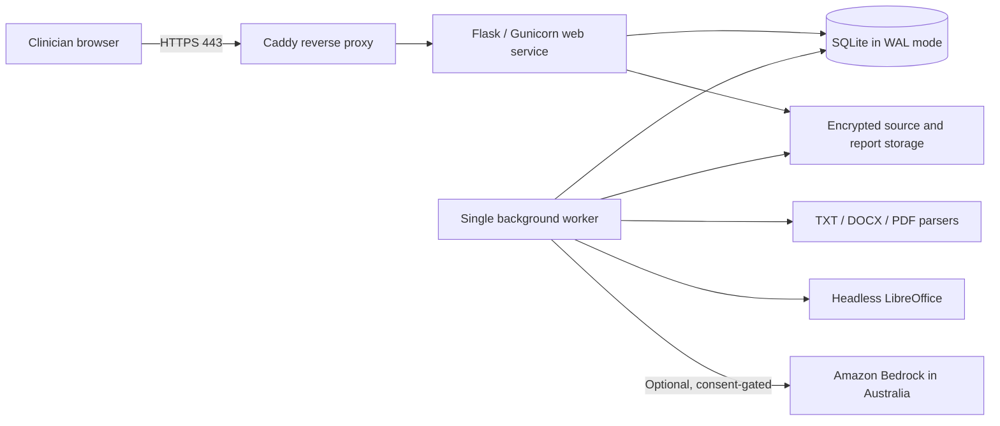

# Architecture

## Purpose and boundary

Clarity turns clinician-supplied assessment material into a structured evidence ledger and an editable ADHD report draft. The Raspberry Pi owns the user interface, application logic, local parsing, clinical records, generated files, and audit trail. When enabled, Amazon Bedrock receives only the case material required for the current extraction or drafting operation.

The implementation deliberately avoids a general-purpose autonomous agent. A typed, deterministic workflow validates model output before it reaches the database or report generator. The same workflow operates with a local development organiser when Bedrock is disabled.

## Deployment topology

Only Caddy is intended to be publicly reachable. The application and worker share the SQLite database and storage volume. The host, SSD, and backup destination must provide encryption at rest; application directory permissions alone are not disk encryption.

## Main flows

### Source extraction

1. Flask authenticates the clinician, checks CSRF and case ownership, validates the file type and size, and writes the source to case-scoped storage.
2. A queued extraction job records the source identifier; clinical text is not copied into the job or audit metadata.
3. The worker claims the job atomically, extracts local text, divides it into source-addressable paragraphs or pages, and calls the configured AI adapter.
4. Structured output is validated before evidence items are written.
5. The clinician edits and verifies each evidence item. Model extraction alone never makes evidence verified.

### Draft generation and approval

1. The application computes completeness warnings from verified evidence, instrument summaries, case history, and criterion decisions.
2. Drafting uses verified structured objects and clinician-entered decisions, not unrestricted source text as authoritative facts.
3. Each drafted paragraph carries internal evidence links. Unsupported claims and score inconsistencies become visible warnings.
4. The clinician edits sections, sets all criterion outcomes and the final conclusion, acknowledges unresolved warnings, and moves the draft to review-ready.
5. Approval creates an immutable versioned snapshot containing the content, prompt version, model identifier, template version, clinician, and timestamp.
6. The worker creates an editable DOCX with deterministic layout. LibreOffice creates a PDF preview when installed.

## Component responsibilities

| Component | Responsibility |
| --- | --- |
| React/Vite | Non-technical clinician workspace, forms, evidence review, criteria, draft editing, and job status |
| Flask/Gunicorn | Authentication, authorization, validation, domain rules, JSON API, and compiled frontend delivery |
| Worker | Resumable parsing, AI calls, report generation, preview conversion, and retry handling |
| SQLite | Users, cases, evidence, criteria, instruments, drafts, jobs, and audit metadata |
| Filesystem | Original uploads, generated DOCX files, previews, and backups |
| Bedrock adapter | Structured extraction and section drafting behind a replaceable interface |
| DOCX renderer | Deterministic template mapping and repeatable report sections |
| Caddy | Public TLS termination and reverse proxying |

## Key technical decisions

- **SQLite instead of DynamoDB:** one to five users and a single host do not need an external database. WAL mode and short transactions support the expected concurrency. DynamoDB Local remains a development emulator rather than a production datastore.
- **Typed workflow instead of AgentCore/Strands:** deterministic stages and Pydantic validation make clinical controls and tests easier to inspect. The AI adapter can later be replaced without changing domain schemas.
- **Database metadata plus filesystem blobs:** SQLite stores searchable metadata and hashes; large original and generated documents remain in case-scoped directories.
- **One worker without Redis or Celery:** job claiming is transactional, failed work is resumable, and operational overhead stays appropriate for the Pi.
- **Deterministic DOCX layout:** the model supplies bounded section content, never arbitrary document layout or executable template logic.
- **No vector database:** source locations and explicit evidence links provide provenance without an additional retrieval service for this POC scale.

## Trust boundaries

- Browser input is untrusted. Server-side authorization, CSRF, extension/content-signature checks, safe filenames, and size limits apply regardless of UI behaviour.
- Uploaded documents are untrusted. Macro-enabled and executable formats are rejected; parsing never executes embedded content.
- Model output is untrusted. It must pass structural validation and clinician verification.
- The reverse proxy and application logs must not contain patient narrative, names, file contents, prompts, or model responses.
- AWS credentials are deployment secrets with Bedrock-invoke-only permissions and are never stored in the repository or database.

## Known POC limitations

- TOTP MFA is not yet implemented.
- A single Pi is not highly available; planned outages and hardware failure require restore procedures.
- Scanned PDFs are identified as lacking extractable text; OCR is not included.
- Proprietary instrument questions and raw scoring are excluded.
- Authorised chart images can be retained as supplied, but automatic chart embedding is not a general extraction feature.
- There is no patient login, automated report delivery, e-signature, billing, or practice-management integration.
