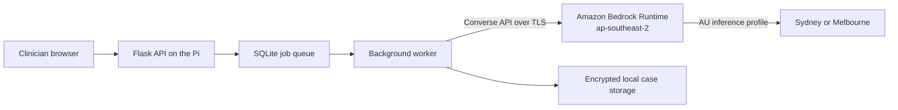

# Connecting Clarity to Amazon Bedrock

This guide connects the Clarity worker to Amazon Bedrock for evidence extraction and report drafting. It covers AWS account preparation, Anthropic model access, least-privilege IAM, local credentials, Docker/Raspberry Pi credentials, application configuration, testing, monitoring, rotation, and troubleshooting.

Clarity does **not** currently provision or invoke an Amazon Bedrock Agent or AgentCore Runtime. The background worker calls the Amazon Bedrock Runtime `Converse` API directly through Boto3. In this repository, “the AWS agent” therefore means the Bedrock-backed clinical drafting provider implemented in `app/ai.py`.



## 1. Know what will leave the device

Document parsing, case storage, evidence review, report rendering, and the job queue remain local. For an extraction or drafting job, the worker sends the relevant supplied text and structured case information to Bedrock. It does not upload the original file as an AWS object.

The configured model identifier is `au.anthropic.claude-sonnet-4-6`, called from `ap-southeast-2`. AWS currently documents this profile as routing a Sydney-origin request to Sydney (`ap-southeast-2`) or Melbourne (`ap-southeast-4`). Keep both values unchanged if this Australian processing boundary is required. Do not replace the model ID with the `global.` profile.

Before processing real patient information:

- complete the privacy impact and threat assessments;
- confirm the practice's patient notice and consent cover AI processing in Australia;
- record the per-case cloud-processing acknowledgement;
- obtain clinical approval for the model, prompt, report structure, and validation process; and
- complete the pre-live controls in [Privacy and threat checklist](privacy-and-threat-checklist.md).

Use only synthetic or properly de-identified data while completing this guide.

## 2. Prerequisites

You need:

- an AWS commercial account with billing configured;
- permission to administer IAM and complete the one-time Bedrock model enablement, or help from an AWS administrator;
- AWS CLI v2 on the development computer or Pi;
- the Clarity Python dependencies installed; and
- outbound HTTPS access to AWS endpoints.

Confirm the CLI is available:

```sh
aws --version
```

Use the Sydney Region throughout this guide:

```text
ap-southeast-2
```

## 3. Complete one-time Anthropic model access

This is an **account setup** operation. Do not give the application's day-to-day runtime identity AWS Marketplace administration permissions.

1. Sign in to the AWS console with an approved setup identity.
2. Select the **Asia Pacific (Sydney) — `ap-southeast-2`** Region.
3. Open **Amazon Bedrock** and then **Model catalog**.
4. Find **Anthropic Claude Sonnet 4.6** and open it in the playground or model details page.
5. Complete Anthropic's first-time-use form if AWS presents it. Describe the clinician-supervised drafting use case accurately; do not enter patient data.
6. Review the applicable AWS and third-party terms before enabling or invoking the model.
7. Make one synthetic playground request or complete the programmatic test in section 6.

AWS currently enables commercial Bedrock foundation models automatically when the account and setup identity have the necessary AWS Marketplace permissions. Anthropic still requires its first-time-use submission. Automatic subscription may take several minutes, during which an invocation can return `AccessDeniedException`.

If your runtime identity cannot have Marketplace permissions, an administrator can complete this step once. After the model is enabled for the account, the runtime identity only needs the invocation permissions below.

## 4. Create the least-privilege runtime policy

Find the AWS account number:

```sh
aws sts get-caller-identity --query Account --output text
```

In **IAM → Policies → Create policy → JSON**, create a policy named `ClarityBedrockInvokeSonnet46`. Replace `ACCOUNT_ID` with the 12-digit account number.

```json
{
  "Version": "2012-10-17",
  "Statement": [
    {
      "Sid": "UseAustralianInferenceProfile",
      "Effect": "Allow",
      "Action": [
        "bedrock:InvokeModel",
        "bedrock:GetInferenceProfile"
      ],
      "Resource": [
        "arn:aws:bedrock:ap-southeast-2:ACCOUNT_ID:inference-profile/au.anthropic.claude-sonnet-4-6",
        "arn:aws:bedrock:ap-southeast-2::foundation-model/anthropic.claude-sonnet-4-6",
        "arn:aws:bedrock:ap-southeast-4::foundation-model/anthropic.claude-sonnet-4-6"
      ]
    }
  ]
}
```

Why all three resources are present:

- the first ARN permits the Australian inference profile called from Sydney;
- the second permits its Sydney destination model; and
- the third permits its Melbourne destination model.

Geographic cross-Region inference fails if IAM or an AWS Organizations service control policy blocks any destination Region in the profile. This application uses non-streaming `Converse`, for which `bedrock:InvokeModel` is sufficient; it does not need `bedrock:InvokeModelWithResponseStream`.

Attach the policy to a dedicated runtime role or identity:

1. Open **IAM → Users** or **IAM → Roles**.
2. Select the identity used only by Clarity.
3. Choose **Add permissions → Attach policies directly**.
4. Find and attach `ClarityBedrockInvokeSonnet46`.
5. Do not attach `AdministratorAccess` or `AmazonBedrockFullAccess` to the runtime identity.

If an administrator needs to discover profiles in the console, grant that administrator—not the runtime identity—`bedrock:ListInferenceProfiles` on `*`.

## 5. Configure a local named AWS profile

For the POC, create a dedicated named profile called `clarity-bedrock`. Prefer temporary role credentials where your AWS environment supports them. If an unattended Pi must use an IAM access key, restrict it with the runtime policy above, store it outside the repository, and rotate it.

Configure the profile:

```sh
aws configure --profile clarity-bedrock
```

Enter:

```text
AWS Access Key ID: <runtime identity access key>
AWS Secret Access Key: <runtime identity secret>
Default region name: ap-southeast-2
Default output format: json
```

AWS writes credentials to the user's shared AWS credentials file and non-secret configuration to the shared AWS config file. Never paste either value into Git, a support ticket, application logs, or this documentation.

Confirm which identity the profile resolves to:

```sh
aws sts get-caller-identity --profile clarity-bedrock
```

The returned account and ARN must be the intended Clarity runtime identity. If they are not, stop here.

### Alternative: short-lived `aws login` credentials for native development

For interactive local development, AWS CLI v2 can use a browser-authenticated console session instead of a long-lived access key. This repository has previously used a source profile named `clarity-bedrock-login` and a Boto3-compatible process profile named `clarity-bedrock`:

```ini
[profile clarity-bedrock-login]
login_session = <created by aws login>
region = ap-southeast-2

[profile clarity-bedrock]
credential_process = aws configure export-credentials --profile clarity-bedrock-login --format process
region = ap-southeast-2
output = json
```

Authenticate or refresh the source profile before starting the worker:

```sh
aws login --profile clarity-bedrock-login
aws sts get-caller-identity --profile clarity-bedrock
```

AWS documents these login sessions as automatically refreshable for up to the IAM principal's session duration, with a maximum of 12 hours. After that, run `aws login` again and restart the worker. This approach also requires the `aws` executable to remain available in the worker's `PATH`, because Boto3 runs the configured `credential_process` command.

Do not use this process profile inside the supplied Docker worker image: the image does not contain AWS CLI or the console-login cache, and browser login is not suitable for an unattended Pi service. Use the restricted runtime credentials described above for Compose, or introduce an approved renewable machine-identity mechanism before production use.

## 6. Verify the inference profile and model independently

First ask the Bedrock control plane for the configured profile:

```sh
aws bedrock get-inference-profile \
  --inference-profile-identifier au.anthropic.claude-sonnet-4-6 \
  --region ap-southeast-2 \
  --profile clarity-bedrock
```

Confirm that:

- `status` is `ACTIVE`;
- `inferenceProfileId` is `au.anthropic.claude-sonnet-4-6`; and
- the listed model ARNs are confined to the expected Australian destination Regions.

Then make a synthetic Converse request:

```sh
aws bedrock-runtime converse \
  --model-id au.anthropic.claude-sonnet-4-6 \
  --messages '[{"role":"user","content":[{"text":"Reply with exactly: Bedrock connection successful"}]}]' \
  --inference-config '{"maxTokens":32,"temperature":0}' \
  --region ap-southeast-2 \
  --profile clarity-bedrock
```

Do not continue until this succeeds. Testing the AWS call separately prevents application, queue, and credential problems from being confused with one another.

## 7. Configure Clarity for native local execution

Set these values in the repository's ignored `.env` file:

```dotenv
BEDROCK_ENABLED=true
AWS_PROFILE=clarity-bedrock
AWS_REGION=ap-southeast-2
BEDROCK_MODEL_ID=au.anthropic.claude-sonnet-4-6
BEDROCK_CONNECT_TIMEOUT_SECONDS=10
BEDROCK_READ_TIMEOUT_SECONDS=600
BEDROCK_SDK_MAX_ATTEMPTS=2
BEDROCK_EXTRACTION_MAX_TOKENS=8000
BEDROCK_DRAFT_MAX_TOKENS=7000
PROMPT_VERSION=2026-08-poc-v4
LOG_LEVEL=INFO
```

The application uses Boto3's standard credential provider chain. `AWS_PROFILE` selects the named profile; access keys are not application settings.

Restart both processes after changing `.env`:

```sh
. .venv/bin/activate
COOKIE_SECURE=false flask --app 'app:create_app()' run --debug --port 8000
```

In a second terminal:

```sh
. .venv/bin/activate
COOKIE_SECURE=false python -m app.worker
```

The worker, not the web process, makes the Bedrock requests.

## 8. Configure Docker Compose on the Raspberry Pi

The container cannot see the host's AWS profile unless it is mounted. The supplied `deploy/compose.aws-profile.yml` mounts a protected external AWS configuration directory read-only into the worker. Use only a dedicated restricted runtime profile here. A profile that requires `aws login`, SSO browser interaction, or `credential_process` is unsuitable for this unattended container and will produce `CredentialRetrievalError`.

Create a credential directory outside the repository. The container runs as UID `10001`, so make that UID the owner:

```sh
sudo install -d -m 700 -o 10001 -g 10001 /srv/clarity/secrets/aws
sudo install -m 600 -o 10001 -g 10001 ~/.aws/config /srv/clarity/secrets/aws/config
sudo install -m 600 -o 10001 -g 10001 ~/.aws/credentials /srv/clarity/secrets/aws/credentials
```

Add these non-secret selectors to `.env`:

```dotenv
AWS_PROFILE=clarity-bedrock
AWS_CONFIG_DIR=/srv/clarity/secrets/aws
```

Start Compose with both files:

```sh
docker compose -f docker-compose.yml -f deploy/compose.aws-profile.yml up -d --build
```

Confirm the worker can resolve the profile without printing credentials:

```sh
docker compose -f docker-compose.yml -f deploy/compose.aws-profile.yml exec worker \
  python -c "import boto3; print(boto3.client('sts').get_caller_identity()['Arn'])"
```

Always use the same two `-f` arguments for later `up`, `run`, `exec`, and `config` commands. The copied credential files are outside the repository but remain sensitive plaintext and must reside on the encrypted SSD. Rotate them as described below.

## 9. Run an end-to-end synthetic test

1. Keep the worker logs visible.
2. Sign in to Clarity.
3. Create a synthetic adult or adolescent case.
4. Acknowledge Australian cloud processing for that case.
5. Upload a synthetic TXT source.
6. Wait for extraction and verify that evidence cards appear.
7. Verify at least one evidence item.
8. Generate a draft.
9. Confirm the report screen reaches a completed state and download the DOCX.

For native execution, watch the worker terminal. For Compose:

```sh
docker compose -f docker-compose.yml -f deploy/compose.aws-profile.yml logs -f worker
```

A successful extraction or draft contains privacy-safe records similar to:

```text
clinical_ai.provider_selected provider=bedrock region=ap-southeast-2 model_id=au.anthropic.claude-sonnet-4-6
bedrock.request_started operation=extract region=ap-southeast-2 model_id=au.anthropic.claude-sonnet-4-6
bedrock.response_received operation=extract region=ap-southeast-2 model_id=au.anthropic.claude-sonnet-4-6 request_id=...
```

The log must not contain the prompt, source text, patient identifiers, or model response. A provider line containing `provider=local-heuristic` means the worker did not load `BEDROCK_ENABLED=true`; restart it after checking `.env`.

Generated draft records should contain:

```text
model_id: au.anthropic.claude-sonnet-4-6
prompt_version: 2026-08-poc-v4
```

## 10. Monitoring without exposing clinical content

Clarity's operational logs are local worker logs. Amazon CloudWatch separately publishes aggregate Bedrock runtime metrics under the `AWS/Bedrock` namespace, including invocation volume, latency, token use, throttling, and client/server errors.

Use CloudWatch metrics for routine AWS-side monitoring. Bedrock **model invocation logging is disabled by default and should remain disabled for this POC**: when enabled, it can store full request and response bodies in CloudWatch Logs or S3. Those bodies can contain sensitive health information. Do not enable text invocation logging without an approved privacy design, encryption and access controls, an Australian-region destination, a retention schedule, incident procedures, and explicit clinical governance approval.

Do not enable Boto3 or Botocore wire-level debug logging with clinical cases. It can expose request content.

## 11. Troubleshooting

| Symptom | Likely cause | Check or resolution |
| --- | --- | --- |
| `profile ... could not be found` | The worker cannot see the named profile | Confirm `AWS_PROFILE`, the user running native mode, or the Compose mount and `/home/app/.aws/config`. Restart the worker. |
| `CredentialRetrievalError` | A `credential_process` profile failed before Bedrock was contacted | For the repository's login profile, run `aws login --profile clarity-bedrock-login`, then `aws sts get-caller-identity --profile clarity-bedrock`, and restart the native worker. If using Docker, replace the login/process profile with the restricted service credentials described in section 8. |
| `NoCredentialsError` | No usable credential provider | Run `aws sts get-caller-identity --profile clarity-bedrock`; for Compose, run the container STS check in section 8. |
| `InvalidClientTokenId` or `UnrecognizedClientException` | Wrong, disabled, or mistyped key | Verify the resolved ARN, key status, account, and any session token. Rotate rather than reusing an exposed key. |
| `ExpiredToken` | Temporary credentials or SSO session expired | Refresh or re-assume the role, then restart the worker. Interactive SSO is unsuitable for an unattended service unless renewal is operationally managed. |
| `AccessDeniedException` on first Anthropic call | FTU form, Marketplace enablement, runtime policy, or propagation incomplete | Complete section 3, wait several minutes, verify the attached policy and resolved identity, then retry the synthetic CLI call. |
| `AccessDeniedException` mentioning an inference profile or destination model | Policy or SCP does not allow the profile, Sydney model, or Melbourne model | Compare the policy to section 4 and ensure organizational Region controls permit both `ap-southeast-2` and `ap-southeast-4`. |
| `ResourceNotFoundException` | Wrong profile ID or source Region | Use the exact model ID and `ap-southeast-2`; run `get-inference-profile`. |
| `ValidationException` | Invalid model ID, request shape, or unsupported parameter | Repeat the minimal Converse CLI test, then check the configured model ID. |
| `ThrottlingException` | Account request/token quota reached | Wait for bounded job retry, reduce concurrency or output size, and review Bedrock Service Quotas. Do not start duplicate jobs. |
| `ReadTimeoutError` | A long response exceeded the client timeout or network path failed | Keep `BEDROCK_READ_TIMEOUT_SECONDS=600`, inspect the request lifecycle logs, test network stability, and retry the resumable job once. |
| CLI works but Clarity uses the local provider | Stale worker environment | Set `BEDROCK_ENABLED=true` and restart the worker process/container. |
| CLI works on the host but Compose fails | Profile was not mounted or cannot be read by UID 10001 | Check `AWS_CONFIG_DIR`, file ownership/mode, use both Compose files, and repeat the container STS check. |
| Bedrock responses succeed but no draft appears | Application job/render issue rather than AWS connectivity | Inspect the Report screen's job status and local worker logs; use [Operations](operations.md) for queue recovery. |

The `request_id` in `bedrock.response_received` or `bedrock.request_failed` can be used when working with AWS Support without exposing the clinical prompt.

## 12. Rotate or revoke credentials

For an IAM access key rotation:

1. Create a second key for the same restricted runtime identity.
2. Update the `clarity-bedrock` profile outside the repository.
3. For Compose, replace `/srv/clarity/secrets/aws/credentials` while preserving owner `10001`, group `10001`, and mode `600`.
4. Restart the worker.
5. Run the STS identity check and synthetic Converse test.
6. Disable the old key.
7. Run one synthetic end-to-end Clarity job.
8. Delete the old key after the verification window.

To disconnect Clarity immediately, set `BEDROCK_ENABLED=false`, restart the worker, and disable the runtime access key or detach the runtime policy. Existing local case data and reports remain available; new AI work uses the non-diagnostic local organiser.

## 13. Future AgentCore migration

AgentCore Runtime and Strands remain deferred. If they are introduced later, keep the clinical schemas, evidence verification, criterion decisions, report renderer, and approval gates unchanged. Add a new provider behind `ClinicalAI`, create a separate least-privilege execution role, document its network and data boundary, and repeat privacy, threat, clinical, and failure-mode validation before use.

## Official AWS references

- [Claude Sonnet 4.6 model details and Australian inference routing](https://docs.aws.amazon.com/bedrock/latest/userguide/model-card-anthropic-claude-sonnet-4-6.html)
- [Prerequisites and IAM actions for model inference](https://docs.aws.amazon.com/bedrock/latest/userguide/inference-prereq.html)
- [Geographic cross-Region inference and IAM requirements](https://docs.aws.amazon.com/bedrock/latest/userguide/geographic-cross-region-inference.html)
- [Request access to Bedrock models and Anthropic first-time use](https://docs.aws.amazon.com/bedrock/latest/userguide/model-access.html)
- [AWS CLI named profiles and shared credential files](https://docs.aws.amazon.com/cli/latest/userguide/cli-configure-files.html)
- [Bedrock Converse API](https://docs.aws.amazon.com/bedrock/latest/APIReference/API_runtime_Converse.html)
- [Bedrock runtime CloudWatch metrics](https://docs.aws.amazon.com/bedrock/latest/userguide/monitoring-runtime-metrics.html)
- [Model invocation logging and its captured content](https://docs.aws.amazon.com/bedrock/latest/userguide/model-invocation-logging.html)
