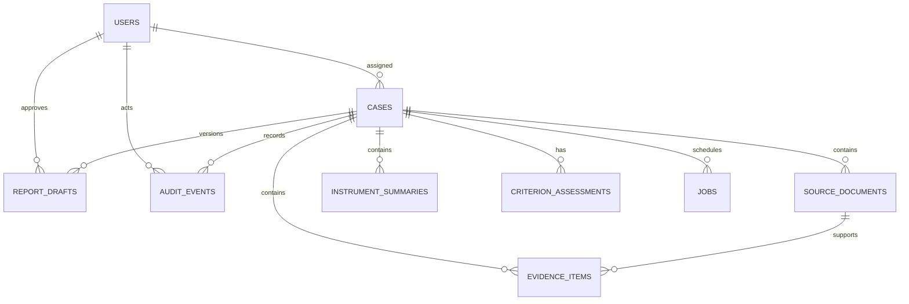

# Data model and storage

## Storage split

SQLite stores identity, workflow, structured clinical records, version metadata, jobs, and audit events. The encrypted filesystem stores original uploads and rendered files. The DOCX template is a versioned, de-identified repository artifact.



All primary identifiers are UUID4 strings. Timestamps are UTC ISO 8601 strings. JSON objects and arrays are encoded as text columns and decoded by the API layer. Foreign keys are enabled and SQLite runs in WAL mode with a 30-second connection timeout.

## Tables

### `users`

Stores admin-created clinician identities, Argon2id password hashes, role, active state, registration number, failed-login window, and lockout time. Passwords and session tokens are never stored in audit metadata.

### `cases`

Stores cohort, patient initials, flexible demographics, referral question, assessment dates, instrument list, consent, current workflow status, clinician-entered final diagnostic conclusion, and assigned user. Case statuses progress through `draft`, `review-ready`, and `clinician-approved`; `archived` removes the case from active workflow without deleting its clinical record.

### `source_documents`

Stores case membership, source type, reporter, setting, instrument, original filename, private relative storage name, SHA-256 hash, MIME value, extraction status, locally extracted text, and creation time. Internal text and storage paths are removed from case API responses.

Extraction states are `pending`, `completed`, and `failed`. The associated job record represents active work and provides retry detail.

### `evidence_items`

Stores a bounded passage and its source location, clinical domain, reporter, setting, confidence, contradiction status, verification flag, and source relationship. Confidence describes extraction confidence only. Verification is always a clinician-controlled boolean.

### `instrument_summaries`

Stores the authorised instrument/version, respondent, supplied score map, clinician interpretation, verification flag, and timestamps. It intentionally has no raw-answer or automated-scoring columns.

### `criterion_assessments`

Contains exactly one record per clinical-schema criterion per case. It stores linked evidence UUIDs, settings, impairment narrative, clinician outcome, notes, and update time. The application validates that linked evidence belongs to the same case.

### `report_drafts`

Stores monotonically increasing case-local version numbers, structured sections, completeness warnings, acknowledgement, template/prompt/model versions, state, approving clinician/time, and relative DOCX/PDF paths. The `(case_id, version)` pair is unique. Approved records are immutable through the API; subsequent generation creates a new version.

### `jobs`

Stores a non-clinical payload, job type, status, attempt count, exception class, availability/lock times, and timestamps. Atomic claiming uses `BEGIN IMMEDIATE`. A running job locked for more than ten minutes is returned to the queue after a worker restart.

Current job types are:

- `extract_source` with a `source_id`;
- `generate_draft` for a case;
- `render_draft` with a `draft_id`.

### `audit_events`

Stores actor, action, optional case and target identifiers, non-sensitive metadata, and time. Actions cover authentication, account creation, case changes, upload, extraction-related workflow, evidence/criteria/instrument edits, draft request/edit/approval, and downloads. Clinical passages, prompts, source text, patient names, and model responses must not be added to audit metadata.

## Filesystem layout

With `STORAGE_ROOT=storage`, application files follow this logical layout:

```text
storage/
├── sources/
│   └── {case_uuid}/
│       └── {source_uuid}.{txt|docx|pdf}
├── reports/
│   └── {case_uuid}/
│       └── report-v{version}.docx
└── previews/
    └── {case_uuid}/
        └── v{version}/
            └── report-v{version}.pdf
```

Database paths are the authority. Filenames derived from users are reduced to a basename for display, while stored filenames use generated UUIDs. The database normally lives at `data/app.db`; its `-wal` and `-shm` files are part of a live SQLite instance and must be handled by the backup procedure.

## Integrity and retention

- Uploaded bytes are hashed with SHA-256 and the hash is audited without recording content.
- Case deletion is intentionally absent from the POC API. Archive, export, retention, and audited deletion must follow the practice’s record-retention policy.
- Back up the database and filesystem as one logical record set. Restoring only one side can leave missing documents or dangling paths.
- The schema currently uses idempotent `CREATE TABLE IF NOT EXISTS` statements rather than a migration framework. Before changing an existing table in a deployed system, add a tested, versioned migration mechanism and backup first.
